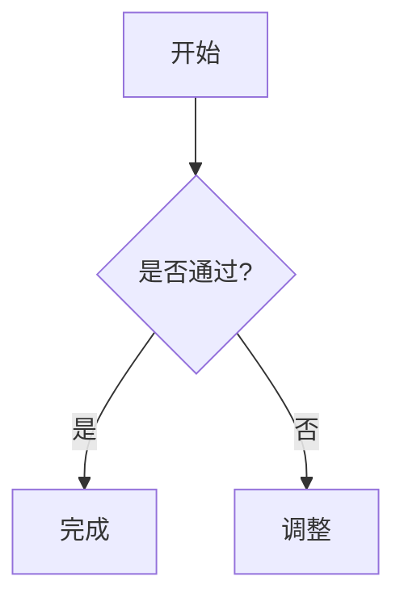

# Markdown

本文档对 Markdown 做了一些增强支持说明，主要包括：

- 目录（TOC）
- 图像尺寸
- 切页视图
- 思维导图
- 自定义提示块
- Mermaid 图表
- Draw.io 图表
- Excalidraw 图表
- 文档链接与资源重写

## 基础语法支持

支持标准的 Markdown 语法和 GFM 语法，包括但不限于： 标题、列表、表格、代码块等。

## 目录（TOC）

自动从文档中提取二级与三级标题（H2/H3）生成 TOC。

### 图像

```md
{width=160}
```

{width=160}

- 支持通过 `{width=100}` 或 `{height=100}` 设置图片展示尺寸，单位为像素
- 图片链接建议使用相对路径或以 `/` 开头的项目路径
- 建议图片尺寸不超过 1MB，过大图片会影响加载速度
- 支持常见图片格式：PNG、JPG、SVG、WebP 等
- 支持图片标题（Title），鼠标悬停时显示
- 支持图片替代文本（Alt），图片无法加载时显示
- 当图片指向站内资源时，会自动重写为静态资源访问路径

:::warning 请注意

- 图片路径区分大小写，确保路径正确。
- 资源链接仅支持相对路径或以 `/` 开头的项目路径。

:::

### 列表

```md
- 无序列表项 1
- 无序列表项 2
  - 嵌套列表项
1. 有序列表项 1
2. 有序列表项 2
```

- 无序列表项 1
- 无序列表项 2
  - 嵌套列表项

1. 有序列表项 1
2. 有序列表项 2

```md
- [x] 已完成任务
- [ ] 未完成任务
```

- [x] 已完成任务
- [ ] 未完成任务

### 表格

```md
| 语法      | 描述       |
| -------- | ---------  |
| 标题      | Title     |
| 段落      | Text      |
```

| 语法 | 描述  |
| ---- | ----- |
| 标题 | Title |
| 段落 | Text  |

讲解数据类型、参数、配置字段时，优先用表格或带注释的 `interface` 代码块来表达字段名、类型、必填性和含义。

```ts
interface UserConfig {
	/** 用户名，必填 */
	username: string;
	/** 是否启用，选填 */
	enabled?: boolean;
}
```

### 代码块

````md
```javascript
function greet() {
  console.log("Hello, World!");
}
```
````

```javascript
function greet() {
	console.log("Hello, World!");
}
```

### 折叠

```html
<details open>
<summary>购物清单</summary>

* 蔬菜
* 水果
* 鱼

</details>
```

<details open>
<summary>购物清单</summary>

- 蔬菜
- 水果
- 鱼

</details>

## 提示块

支持自定义提示块，语法如下：

```md
:::note
这是一个说明块，可以包含 **Markdown** 语法。
:::

:::tip
这是一个提示块，可以包含 **Markdown** 语法。
:::

:::info
这是一个信息块，可以包含 **Markdown** 语法。
:::

:::warning
这是一个警告块，可以包含 **Markdown** 语法。
:::

:::danger
这是一个危险块，可以包含 **Markdown** 语法。
:::

:::caution
这是一个注意块，可以包含 **Markdown** 语法。
:::

```

:::note

这是一个说明块，可以包含 **Markdown** 语法。

:::

:::tip

这是一个提示块，可以包含 **Markdown** 语法。

:::

:::info

这是一个信息块，可以包含 **Markdown** 语法。

:::

:::warning

这是一个警告块，可以包含 **Markdown** 语法。

:::

:::danger

这是一个危险块，可以包含 **Markdown** 语法。

:::

### 设置标题

可以为提示块设置标题：

```md
:::tip 自定义标题
这是一个带有自定义标题的提示块。
:::
```

也支持显式属性写法：

```md
:::tip{title="自定义标题"}
这是一个带有自定义标题的提示块。
:::
```

:::tip

自定义标题这是一个带有自定义标题的提示块。

:::

## 切页

支持通过以下语法实现切页面板：

```md
:::tabs 面板标题
== 选项一
- **选项一** 内容 A
== 选项二
- **选项二** 内容 B
:::
```

:::tabs 面板标题

== 选项一

- **选项一** 内容 A

== 选项二

- **选项二** 内容 B

:::

### 共享选中状态

通过设置 `key` 属性，可以让多个切页组件共享选中状态。

````md
:::tabs key:npm 安装 npm 包
== npm
```bash
npm i serve
```
== yarn
```bash
yarn add serve
```
:::


:::tabs key:npm 运行命令
== npm
```bash
npm run serve
```
== yarn
```bash
yarn serve
```
:::

也可以使用属性语法：

```md
:::tabs{key=npm title="安装"}
== npm
...
:::
```
````

:::tabs key:npm 安装 npm 包

== npm

```bash
npm i serve
```

== yarn

```bash
yarn add serve
```

:::

:::tabs key:npm 运行命令

== npm

```bash
npm run serve
```

== yarn

```bash
yarn serve
```

:::

## Mermaid

支持直接写 `mermaid` 代码块，前端会自动渲染为 SVG 图表：

- Mermaid 只适合极短、单路径、少节点的流程图或关系图；如果要讲很多节点、很多分支或跨层关系，就改用 draw.io / Excalidraw，必要时再按切页规范拆成“图形 + 结构说明”
- Mermaid 尽量使用竖向排版，例如 `graph TD` / `flowchart TD`，避免横向 `LR` 把图压得过宽

````md

````


## Draw.io

支持通过 `{drawio}` 标记渲染 draw.io 图表：

```md
{drawio}
```

{drawio width=400}

你同样可以限制图表的显示尺寸（支持 `width`/`height`）：

```md
{drawio width=300}
```

{drawio width=300}

如果同一个 draw.io 文件里有多个切页，可以在文件路径后追加 hash 指定要渲染的切页名称：

```md
{drawio}
```

hash 会按 URL fragment 规则解码，`#运行期更新` 与对应的百分号编码写法等价。

### 主题

Draw.io 默认使用 `theme=auto`，会根据当前页面明暗模式自动切换。如果你需要固定主题，可以显式指定：

```md
{drawio theme=light}
{drawio theme=dark}
```

当显式指定的主题与当前页面明暗模式不一致时，图表会自动补充背景色，避免内容在深/浅色中不可读。

### 文件格式与路径

- 仅支持 `.drawio` / `.xml` 文件
- 相对路径以当前文档所在目录为基准
- 站内资源会自动重写为静态资源访问路径
- 多切页文件可以通过 URL hash 指定 draw.io 内部 `<diagram name="...">` 页签

:::tabs 主题示例

== 自动主题

{drawio theme=auto width=300}

== 浅色主题

{drawio theme=light width=300}

== 深色主题

{drawio theme=dark width=300}

:::

## Excalidraw

支持通过 `{excalidraw}` 标记渲染 Excalidraw 图表：

```md
{excalidraw}
```

{excalidraw}

你同样可以限制图表的显示尺寸（支持 `width`/`height`）：

```md
{excalidraw width=460 height=260}
```

### 主题

Excalidraw 默认使用 `theme=auto`，会根据当前页面明暗模式自动切换。如果你需要固定主题，可以显式指定：

```md
{excalidraw theme=light}
{excalidraw theme=dark}
```

### 文件格式与路径

- 仅支持 `.excalidraw` / `.json` 文件
- 相对路径以当前文档所在目录为基准
- 站内资源会自动重写为静态资源访问路径

## 思维导图

### 通过代码块添加

````md
```mindmap height=300
# 中心主题
## 分支一
### 子主题 1
### 子主题 2
## 分支二
```
````

支持额外参数：

- `width` / `height`：图表尺寸（支持数字或 CSS 尺寸）
- `type` / `style`：Mindmap 类型

```mindmap height=300
# 中心主题
## 分支一
### 子主题 1
### 子主题 2
## 分支二
```

### 通过标记添加

支持通过 `{mindmap}` 标记渲染思维导图（源文件必须是 `.md/.markdown`）：

```md
{mindmap width=600 height=400}
```

- 相对路径以当前文档所在目录为基准；
- 如果是站内可访问资源，会在前端尝试读取。

{mindmap width=600 height=400}

## 链接资源

- 文档链接会自动重写为站内路由
- 非 Markdown 文件的链接会自动重写为静态资源路径
  - `http/https` 外链不会被重写或收集

### 文档引用规则

#### 推荐写法

- 同目录：使用相对路径
- 跨目录：使用相对路径或项目路径
- 引用 Markdown 时可省略 `.md` 后缀
- 裸相对路径视同 `./`，例如 `guide/overview` 等同于 `./guide/overview`

示例：

```md
[同级文档](./getting-started)
[同级文档-裸相对](getting-started)
[子目录文档](./guide/overview)
[子目录文档-裸相对](guide/overview)
[上级文档](../architecture/index)
[跨目录文档](/docs/architecture/index)
```
